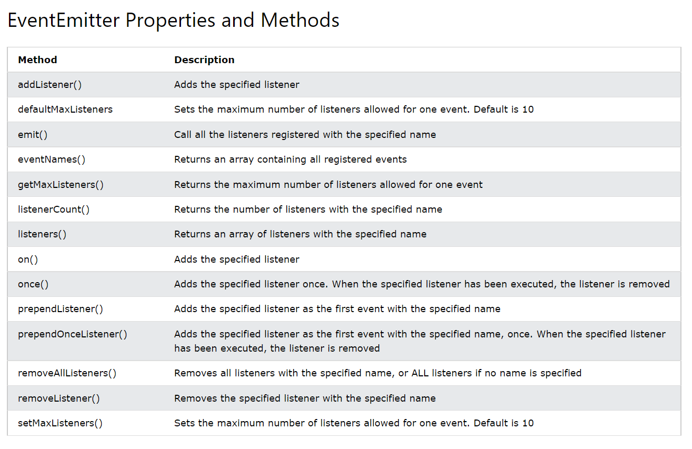

## Node.js `events` Module
Working with events module is pretty complex. it's not like any other module in nodejs. It's Gives us a Class So have to make a object blueprint using that class and object gives some methods By Which can work through it.

-  The syntax for including the Events module, and creating an EventEmitter in your application:
  - One Thing need to know as order listener must have to be before emitter. 

```js
  var EventEmitter = require('events');
  var emitter = new EventEmitter();

// Listining And Event:
  emitter.on('scream', function() {
    console.log('A scream is detected!');
  });

// Event Raised:
  emitter.emit('scream');
```

- `Events Emits form Different Modules`:  Whenever Trying to emit events form different module may think just require and make an instance but don't worry it will not work. Think abou Class Core concepts like class is a blueprint of object when creating new obejcts form class each object is different form others. So working together somehow have to make a connection between emitter and listener. Make a different class which will extends emitter and export class instance. 

```js
//Custom Class
const EventEmitter = require('events')

class School extends EventEmitter {
     start(){
        console.log("Class Started")
        setTimeout(() => {
        this.emit('classSes','Class is Finished, Teacher go back' )
        },3000)        
    }
}

module.exports = School
```


```js
//Raise And Listen Events using that Class

const School = require('./eventClass')
const school = new School()

// Listening And Event:
school.on('classSes', function(data) {
  console.log(data);
});


// Event Raised:    
school.start()

```



